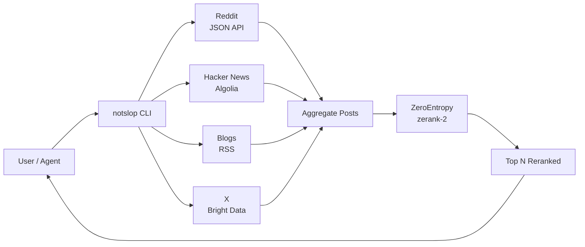

<p align="center">

# NOTSLOP

**No more AI slop.** Real-time social context for AI agents to ground their content in what's actually happening today.

</p>

<p align="center">
  <a href="https://www.npmjs.com/package/notslop"></a>
  <a href="https://nodejs.org"></a>
  <a href="./LICENSE"></a>
  <a href="https://github.com/adrienckr/notslop/actions"></a>
</p>

<p align="center">
  
  <br/>
  <sub>Demo renders from <a href="./demo.tape"><code>demo.tape</code></a> — run <code>brew install vhs &amp;&amp; vhs demo.tape</code> to regenerate.</sub>
</p>

---

## The pitch

LLMs hallucinate because their training cutoff is months old. They don't know what trended this morning, what people are saying about a release right now, what your competitors blogged yesterday. Plug a query into Claude and out comes a generic essay with made-up "trends" — the kind of slop that dies in a Reddit comments section within twenty minutes.

NOTSLOP feeds your agent the actual signal. Reddit + Hacker News + curated X handles + competitor blogs you choose, all reranked by [ZeroEntropy](https://dashboard.zeroentropy.dev?utm_source=notslop-cli&utm_medium=readme&utm_campaign=v0.2) so the top 10 are the ones that matter, not 200 noisy keyword matches. Your agent reads the room before it writes the post. The post stops being slop.

---

## Quickstart

```bash
npx notslop init                  # interactive wizard: ZE key, X handles, blogs
npx notslop install --claude      # drop 12 skills into ~/.claude/skills/, see splash
```

After install, open Claude Code and try:

- `/notslop digest about <topic>`
- `/notslop write a tweet about <topic>`
- `/notslop write an X article about <topic>`
- `/notslop find related to <url>`

The CLI also works directly in any shell:

```bash
notslop digest "Anthropic MCP" --since 24h --top 5 --format md
```

---

## The content workflow

Stop writing AI slop. Your agent shouldn't be the 47th LLM hallucinating about a topic it doesn't know. Here is the loop NOTSLOP unlocks inside Claude Code:

```
You (in Claude Code): "Write a tweet about what's hot on Anthropic MCP today"

Claude → bash: notslop digest "Anthropic MCP" --since 24h --format json
Claude → reads top 10 reranked posts across reddit, hn, blogs, x
Claude → writes the tweet, citing 2 specific data points
Claude → shows you the draft

You: copy, paste, ship
```

The two content-creation skills shipped in this repo — [`notslop-write-post`](./skills/notslop-write-post/SKILL.md) and [`notslop-repurpose`](./skills/notslop-repurpose/SKILL.md) — make this automatic. Drop them into `~/.claude/skills/`, ask Claude for a post, and the digest call is invisible to you.

The output is a post grounded in two specific things people said in the last 24 hours, with URLs. Not a thinkpiece. Not a vibes essay. A post that survives contact with the actual conversation.

---

## CLI reference

| Command    | Description                                            |
|------------|--------------------------------------------------------|
| `init`     | Interactive setup: ZeroEntropy key, X handles, blogs   |
| `notslop install --claude` | Drop 12 skills into `~/.claude/skills/` and show suggested slash commands |
| `digest`   | Multi-source digest of recent conversations on a topic |
| `trending` | What's blowing up right now in a niche                 |
| `pulse`    | Mention tracker for a topic over a window              |
| `voices`   | Surface influential voices on a topic                  |

Common options:

| Flag                 | Description                                                    |
|----------------------|----------------------------------------------------------------|
| `--since <duration>` | `1h`, `6h`, `24h`, `7d`, `30d`, `all` (per-command default)    |
| `--sources <list>`   | Comma-separated: `reddit,hn,blogs,x` (default: all configured) |
| `--top <n>`          | Number of top results after rerank (default: 10)               |
| `--format <fmt>`     | `json`, `md`, or `table` (default: `md`)                       |
| `--debug`            | Show ZE rerank scores per item                                 |
| `--no-cache`         | Bypass cache, fresh fetch                                      |
| `--config <path>`    | Override config file path                                      |

Command-specific:

- `pulse --window <duration>` (default `7d`, alias `--since`)
- `voices --limit <n>` (default `5`)

---

## Sources

| Source       | Backend                          | Cost                             | Notes                              |
|--------------|----------------------------------|----------------------------------|------------------------------------|
| `reddit`     | Public JSON API                  | Free                             | Always on                          |
| `hn`         | Algolia API                      | Free                             | Always on                          |
| `blogs`      | RSS or HTML scrape               | Free                             | You configure the URLs             |
| `x`          | Bright Data Datasets API         | ~$0.001–$0.01 per tweet          | Optional, bring your own key       |

Four feeds you actually control. No mystery algorithm. No "what the For You page wants you to see." You curate the X handles and the blog list. NOTSLOP does the fetching and the reranking.

---

## Architecture



Each platform adapter normalizes its native payload into a shared `Post` shape (`source`, `sub_source`, `title`, `author`, `posted_at`, `url`, `text`, `engagement`). The aggregator concatenates pools, deduplicates by URL, and hands the full set to `zerank-2`. You see the ranked top N; the raw fetch counts live in the footer.

Why rerank? A raw 200-post pull mixes on-topic gold with adjacent chatter, low-signal jokes, and posts that happened to match a keyword. Without rerank you get 200 noisy items and your agent gets confused. With ZeroEntropy you get the 10 that actually answer the question. Generic essays die in Reddit comments — grounded ones don't.

---

## Claude Code skills

Six `SKILL.md` files ship under [`skills/`](./skills/). Four are read-only digests; two write content grounded in the digest output.

**Read the room:**

- [`skills/notslop-digest/`](./skills/notslop-digest/SKILL.md) — "what's everyone saying about X"
- [`skills/notslop-trending/`](./skills/notslop-trending/SKILL.md) — "what's hot right now in X"
- [`skills/notslop-pulse/`](./skills/notslop-pulse/SKILL.md) — "track mentions of X over a window"
- [`skills/notslop-voices/`](./skills/notslop-voices/SKILL.md) — "who's talking about X"

**Write the post:**

- [`skills/notslop-write-post/`](./skills/notslop-write-post/SKILL.md) — fresh post grounded in today's digest
- [`skills/notslop-repurpose/`](./skills/notslop-repurpose/SKILL.md) — adapt existing content with current context layered in

To install, copy each directory into `~/.claude/skills/`:

```bash
cp -r ./skills/notslop-digest      ~/.claude/skills/notslop-digest
cp -r ./skills/notslop-trending    ~/.claude/skills/notslop-trending
cp -r ./skills/notslop-pulse       ~/.claude/skills/notslop-pulse
cp -r ./skills/notslop-voices      ~/.claude/skills/notslop-voices
cp -r ./skills/notslop-write-post  ~/.claude/skills/notslop-write-post
cp -r ./skills/notslop-repurpose   ~/.claude/skills/notslop-repurpose
```

Cursor and Cline users: point your tool's skill/rule loader at the same files.

---

## Setup

Environment variables:

- `ZEROENTROPY_API_KEY` — required. Free key from [dashboard.zeroentropy.dev](https://dashboard.zeroentropy.dev?utm_source=notslop-cli&utm_medium=readme&utm_campaign=v0.2).
- `BRIGHTDATA_API_KEY` — optional, enables the `x` source.
- `BRIGHTDATA_DATASET_ID` — optional, override the default X dataset id.
- `ZEROENTROPY_BASE_URL` — optional, point at a self-hosted ZE instance.

Config file location: `~/.notslop/config.json`. Written by `notslop init`. Holds API keys, default `--since`, per-source fetch limits, cache TTL, and your curated lists of subreddits / X handles / blog URLs.

---

## Development

```bash
git clone https://github.com/adrienckr/notslop
cd notslop
npm install
npm run dev -- digest "test" --sources reddit
npm run build
npm test
```

---

## Roadmap (v0.3+)

- Bluesky as a fifth platform.
- Direct X scraping fallback so X works without a Bright Data key.
- Cross-source dedup (one canonical item per story across Reddit / HN / blogs / X).
- Webhook + cron mode for scheduled digests pushed into a channel.
- More content-creation skills: `notslop-thread` (X thread builder), `notslop-newsletter` (weekly digest → email-ready copy).

---

## License

MIT — see [LICENSE](./LICENSE).

---

Powered by [ZeroEntropy](https://dashboard.zeroentropy.dev?utm_source=notslop-cli&utm_medium=readme-footer&utm_campaign=v0.2). Free API key, no credit card. The reranker is the reason your agent stops sounding like the rest of them.
