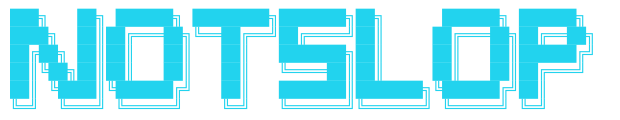

<p align="center">
  
</p>

<p align="center">
  <strong>Fresh social context for AI agents.</strong><br/>
  Reddit, Hacker News, blogs, X — reranked, piped into Claude Code via 19 skills.
</p>

<p align="center">
  <a href="https://www.npmjs.com/package/notslop"></a>
  <a href="https://nodejs.org"></a>
  <a href="./LICENSE"></a>
</p>

---

## What it does

Ask Claude Code to write a tweet, a blog post, a Reddit reply, a cold DM. Claude doesn't know today's signal — training cutoff is months old — so the output reads like AI slop: generic, vague, citing "trends" that don't exist.

`notslop` is the data layer that fixes it. A shell command that pulls today's actual discussions across Reddit, HN, blogs, and X. Reranks them by relevance with [ZeroEntropy](https://zeroentropy.dev). Hands the top 10 to the agent before it writes.

The post stops reading like slop.

---

## 60-second setup

Two free accounts, two commands.

**1.** Get a [ZeroEntropy](https://dashboard.zeroentropy.dev) key — free tier covers most usage.

**2.** Get an [Orthogonal](https://orthogonal.com/sign-up) key — optional, only if you want X scraping. $10 free credits at signup (~500 X scrapes).

**3.** Install:

```bash
npx notslop init             # paste the two keys, pick handles / subreddits / blogs
npx notslop install --claude # drops 19 skills into ~/.claude/skills/
```

Open Claude Code. Type *"write me a tweet about &lt;your topic&gt;"*. Done.

---

## Skills

Trigger any of the 19 skills with natural language inside Claude Code.

**Content creation (14)** — `write-x-tweet`, `write-x-thread`, `write-x-article`, `write-linkedin-post`, `write-reddit-post`, `write-reddit-reply`, `write-blog-post` (SEO-aware, 1500–3000 words), `write-blog-headline`, `write-show-hn-post`, `write-product-hunt-launch`, `write-readme-pitch`, `write-cold-dm`, `write-twitter-bio`, `repurpose`.

**Research & analysis (5)** — `digest` (what's hot today), `trending` (what's blowing up in 6h), `pulse` (theme-clustered mention tracker), `voices` (influential authors on a topic), `find-related` (semantic similarity to a draft).

Each skill is a small `SKILL.md` in `~/.claude/skills/notslop-*/` after `install --claude`. Read them, tweak them, fork them — they're MIT.

### Skills are community-driven

The 14 content skills are starting points. They work — but the quality ceiling on each surface (the right hook for an X thread, the right anatomy for a Show HN post, the right tone for a LinkedIn opener) comes from people who write that kind of content every day. If you do, your taste is exactly what's missing.

PRs that **sharpen** a skill — tighter output rules, a better hook pattern, killing a recurring slop phrase, adding a tone variant — are the most useful contributions notslop can get. PRs that **add a new content skill** for a platform or format not yet covered are also welcome.

How to contribute: read the [Contributing to content skills](./CONTRIBUTING.md#contributing-to-content-skills) section in `CONTRIBUTING.md`. The bar for getting a PR merged is *"this clearly produces less slop"* — concrete before/after examples in the PR description make that easy to judge.

---

## How it works

Your phrase to Claude Code matches one of the 19 skills. The skill runs `notslop digest "<your topic>" --for-content` in bash, which kicks off the pipeline:

```
        ┌────────┬──────────┬──────────────┬────────────────┐
        ▼        ▼          ▼              ▼                ▼
     reddit    hn        blogs           x               (4 sources)
     JSON    Algolia   RSS+cheerio   Orthogonal
     (free)  (free)    (free)        (~$0.02/handle)
        │
        ▼
   ZeroEntropy zembed-1 — cross-source dedup
        │
        ▼
   ZeroEntropy zerank-2 — rerank top 10 by semantic relevance
        │
        ▼
   condensed JSON → Claude writes the post, citing real data points
```

Total round-trip: 1–3s warm cache, 5–10s fresh fetch.

---

## CLI commands

```bash
notslop digest        "<topic>"      # multi-source reranked digest
notslop trending      "<niche>"      # what's blowing up right now (6h)
notslop pulse         "<topic>"      # theme-clustered mention tracker (7d)
notslop voices        "<topic>"      # influential authors on a topic
notslop find-related  "<text|url>"   # semantic similarity search
notslop sources                      # status of every configured source
notslop list ls                      # manage named lists (x_profiles, subs, blogs)
```

`notslop --help` for full flags.

---

## Sources & providers

Two keys total. ZeroEntropy is required; Orthogonal is optional.

| Source | Provider | Cost |
|---|---|---|
| Reddit, HN, blogs | built-in (public APIs / RSS) | free |
| Rerank + embed | ZeroEntropy | free tier covers most usage |
| X (Twitter) | Orthogonal → ScrapeCreators | $10 free → ~$0.02 per handle scrape |

Per-source setup walkthroughs are in [PROVIDERS.md](./PROVIDERS.md). `notslop sources` prints what's wired on your machine. `notslop sources --check x` live-tests a source.

---

## Configuration

`notslop init` writes `~/.notslop/config.json`. Env vars override what's in the file:

```
ZEROENTROPY_API_KEY      required — rerank + embed (runs locally)
ORTHOGONAL_API_KEY       optional — X scraping
```

---

## Companion repos

- [`notslop-api`](https://github.com/adrienckr/notslop-api) — optional stateless gateway behind a `--api <url>` flag for teams that want to centralize scraping. MIT. Self-host on Fly.io.
- [`notslop-web`](https://github.com/adrienckr/notslop-web) — the landing page at [notslop.dev](https://notslop.dev). Astro + Tailwind. MIT.

---

<sub>Built by <a href="https://github.com/adrienckr">@adrienckr</a>. MIT-licensed.</sub>
