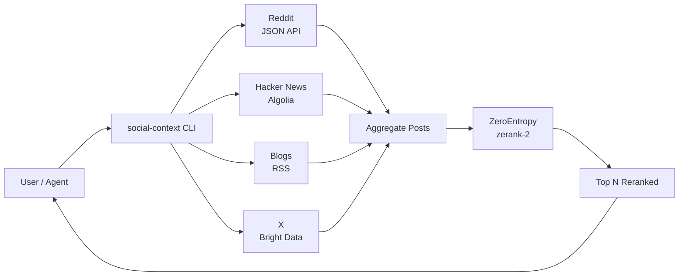

<h1 align="center">social-context</h1>

<p align="center">
  <strong>Give your AI agents eyes on what's happening today.</strong><br/>
  Pulls Reddit, Hacker News, blogs, and X — reranked by
  <a href="https://dashboard.zeroentropy.dev?utm_source=social-context-cli&utm_medium=readme&utm_campaign=v0.1">ZeroEntropy</a>.
</p>

<p align="center">
  <a href="https://www.npmjs.com/package/social-context"></a>
  <a href="https://nodejs.org"></a>
  <a href="./LICENSE"></a>
  <a href="https://dashboard.zeroentropy.dev?utm_source=social-context-cli&utm_medium=readme&utm_campaign=v0.1"></a>
</p>

<p align="center">
  
  <br/>
  <sub>Animated demo renders from <a href="./demo.tape"><code>demo.tape</code></a> — run <code>brew install vhs &amp;&amp; vhs demo.tape</code> to regenerate.</sub>
</p>

---

## The pitch

Training cutoffs make agents blind. They don't know what trended this morning, what people are saying about a release that shipped last week, or what your competitors blogged yesterday. Out-of-the-box LLMs answer from a frozen snapshot of the world.

`social-context` pulls from four sources you control — Reddit, Hacker News, a curated list of blogs, and a curated list of X handles — then reranks the combined pool with ZeroEntropy's `zerank-2` model. You get the top 10 actually-relevant items instead of 200 noisy ones. One command, JSON or markdown out, agent-ready.

---

## Quickstart (60 seconds)

```bash
npx social-context init
# wizard asks for ZE API key (free), X handles, blog list, default subs

npx social-context digest "AI agents" --since 24h
```

---

## What you get

- Four source adapters: `reddit` `hn` `blogs` `x` — toggle any combination with `--sources`.
- A single ranked list out, reranked by ZeroEntropy `zerank-2` against your query.
- Three output formats — `md` (default, terminal-pretty), `json` (agent-pipeable), `table` (cli-table3).
- Four ready-to-install Claude Code skills under [`skills/`](./skills/).
- Predictable exit codes, a cache layer, and a footer that tells you exactly how many items came from where.

---

## Demo

Output of `social-context digest "Anthropic MCP" --since 24h` against a live mix of Reddit, HN, blog RSS, and X:

```text
╭────────────────────────────────────────────────╮
│  Anthropic MCP — last 24h                      │
╰────────────────────────────────────────────────╯

  ✓ reddit         42 posts in 612ms
  ✓ hn             18 posts in 489ms
  ✓ blogs           6 posts in 1124ms
  ✓ x              24 posts in 1380ms
  ✓ zerank-2      90 → 5 in 731ms

   1. [reddit · r/ClaudeCode]   0.94
      MCP server adoption is finally clicking — 12 new ones this week
      @user_a · 4h ago · https://reddit.com/r/ClaudeCode/comments/1mc9xx2

   2. [hn · Front Page]   0.91
      Model Context Protocol becomes a de-facto standard for tool calling
      @patio11 · 6h ago · https://news.ycombinator.com/item?id=42301188

   3. [blogs · anthropic.com]   0.88
      MCP one year in: what worked, what we are changing
      anthropic.com · 9h ago · https://anthropic.com/news/mcp-one-year

   4. [reddit · r/LocalLLaMA]   0.84
      MCP vs OpenAI function calling vs raw JSON — benchmark thread
      @researcher_42 · 11h ago · https://reddit.com/r/LocalLLaMA/comments/1mc7q4p

   5. [hn · Comments]   0.79
      "MCP is the only spec that survived contact with real agent workloads"
      @dang · 14h ago · https://news.ycombinator.com/item?id=42300411

90 posts reranked across 4 sources in 4336ms
Powered by ZeroEntropy  ·  https://dashboard.zeroentropy.dev?utm_source=social-context-cli&utm_medium=output-footer&utm_campaign=v0.1
```

A frozen markdown copy of this output lives at [`.github/assets/demo-output.md`](./.github/assets/demo-output.md).

---

## Architecture



Each platform adapter normalizes its native payload into a shared `Post` shape (`source`, `sub_source`, `title`, `author`, `posted_at`, `url`, `text`, `engagement`). The aggregator concatenates pools, deduplicates by URL, and hands the full set to `zerank-2`. You see the ranked top N; the raw fetch counts live in the footer.

---

## CLI reference

| Command    | Description                                                  |
|------------|--------------------------------------------------------------|
| `init`     | Interactive setup: ZeroEntropy key, X handles, blog list     |
| `digest`   | Multi-source digest of recent conversations on a topic       |
| `trending` | What's blowing up right now in a niche                       |
| `pulse`    | Mention tracker for a topic over a window                    |
| `voices`   | Surface influential voices on a topic                        |

Common options:

| Flag                 | Description                                                    |
|----------------------|----------------------------------------------------------------|
| `--since <duration>` | `1h`, `6h`, `24h`, `7d`, `30d`, `all` (per-command default)    |
| `--sources <list>`   | Comma-separated: `reddit,hn,blogs,x` (default: all configured) |
| `--top <n>`          | Number of top results after rerank (default: 10)              |
| `--format <fmt>`     | `json`, `md`, or `table` (default: `md`)                      |
| `--debug`            | Show ZE rerank scores per item                                |
| `--no-cache`         | Bypass cache, fresh fetch                                     |
| `--config <path>`    | Override config file path                                     |

Command-specific:

- `pulse --window <duration>` (default `7d`, alias `--since`)
- `voices --limit <n>` (default `5`)

---

## Sources

| Source       | Backend                          | Cost                             | Notes                              |
|--------------|----------------------------------|----------------------------------|------------------------------------|
| `reddit`     | Public JSON API                  | Free                             | Always on                          |
| `hn`         | Algolia API                      | Free                             | Always on                          |
| `blogs`      | RSS or HTML scrape               | Free                             | You configure the URLs             |
| `x`          | Bright Data Datasets API         | ~$0.001–$0.01 per tweet          | Optional, bring your own key       |

---

## How ZeroEntropy fits in

Social feeds are noisy. A raw 200-post pull from Reddit + HN + your blog list mixes on-topic gold with adjacent chatter, low-signal jokes, and outright off-topic posts that happened to match a keyword. `zerank-2` scores every item against your query and lets you keep the top N that actually answer the question.

```text
                 Without rerank                       With ZeroEntropy
                 ──────────────                       ─────────────────
  Fetch:         200 posts                            200 posts
  Filter:        keyword match only                   semantic relevance
  Top 10 hit:    ~3 truly on-topic                    ~9 truly on-topic
  Agent diet:    200 raw, noisy, token-heavy          10 ranked, lean
  Output:        "I found a lot of stuff..."          "Here are the 5 things that matter."
```

Free API key at [dashboard.zeroentropy.dev](https://dashboard.zeroentropy.dev?utm_source=social-context-cli&utm_medium=readme&utm_campaign=v0.1).

---

## Setup

Environment variables:

- `ZEROENTROPY_API_KEY` — required. Free key from [dashboard.zeroentropy.dev](https://dashboard.zeroentropy.dev?utm_source=social-context-cli&utm_medium=readme&utm_campaign=v0.1).
- `BRIGHTDATA_API_KEY` — optional, enables the `x` source.
- `BRIGHTDATA_DATASET_ID` — optional, override the default X dataset id.
- `ZEROENTROPY_BASE_URL` — optional, point at a self-hosted ZE instance.

Config file location: `~/.social-context/config.json`. Written by `social-context init`. Holds your API keys, default `--since`, per-source fetch limits, cache TTL, and your curated lists of subreddits / X handles / blog URLs.

---

## Claude Code skills

Four `SKILL.md` files ship in this package under [`skills/`](./skills/):

- [`skills/digest/`](./skills/digest/SKILL.md) — "what's everyone saying about X"
- [`skills/trending/`](./skills/trending/SKILL.md) — "what's hot right now in X"
- [`skills/pulse/`](./skills/pulse/SKILL.md) — "track mentions of X over a window"
- [`skills/voices/`](./skills/voices/SKILL.md) — "who's talking about X"

To install, copy each directory into `~/.claude/skills/`:

```bash
cp -r ./skills/digest ~/.claude/skills/social-context-digest
cp -r ./skills/trending ~/.claude/skills/social-context-trending
cp -r ./skills/pulse ~/.claude/skills/social-context-pulse
cp -r ./skills/voices ~/.claude/skills/social-context-voices
```

Cursor and Cline users: point your tool's skill/rule loader at the same files.

---

## Development

```bash
git clone https://github.com/adrienckr/social-context
cd social-context
npm install
npm run dev -- digest "test" --sources reddit
npm run build
npm test
```

---

## Roadmap (v0.2+)

- Bluesky as a fifth platform.
- Direct X scraping fallback so X works without a Bright Data key.
- Cross-source dedup (one canonical item per story across Reddit / HN / blogs / X).
- Webhook + cron mode for scheduled digests pushed into a channel.
- Hosted SaaS option with managed Bright Data and ZE quotas.

---

## License

MIT — see [LICENSE](./LICENSE).
